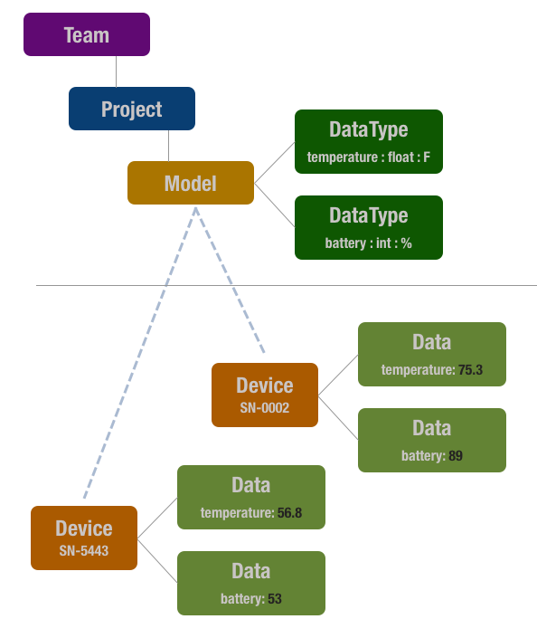

# SimpleIOT Command-Line-Interface (CLI)


This is the command-line-interface (CLI) for the [SimpleIOT](https://simpleiot.net) framework.

SimpleIOT abstracts out IoT device connectivity and hides the underlying details so you can focus on your application's unique features.

## Basic Concepts



In the SimpleIOT world, an installation supports the following concepts:

- **team**: A single installation of SimpleIOT in the cloud. This is mainly relevant to using the Command-Line-Interface (CLI) tool.
- **project**: Each backend supports one or more _Projects_.
- **Model**: A _Model_ describes a device's capabilities. For example, what data it likes to exchange with the cloud, whether an end-node or a gateway device, what features it supports (i.e., storage, encryption, or AI/ML.), and how it communicates with the cloud.
- **DataType**: A _DataType_ is a single named value that can be exchanged between a device and the cloud. A _Model_ typically has one or more _DataTypes_ associated with it.
- **Device**: A _Device_ represents a single instance of a _Model_. Each device has a unique identification via its _serial_number_.
- **Data**: A _Data_ element is an instance of a _DataType_ associated with a single _Device_. For example, if a _Model_ defines a _DataType_ named `pressure`, each unique _Device_ will have its own instance of `pressure`. You can get/set values associated with each _Device_ instance by name.

_Data_ elements are bi-directional so that updates go from the devices to or from the cloud back to the device. It is up to the firmware to handle what to do with values received from the cloud.

## Dual-use

This CLI can be used by both backend administrators as well as end-users.

As an Administrator, you need to:
- Have one or more AWS accounts with IAM Administrative privileges.
- Configure a profile for each account by running the `aws configure` command.

With this CLI, you can:

- Create a private, serverless IOT backend on AWS.
- Create one or more Teams (individual backend installations on each account).
- Securely invite users to join the team (including support for bulk emailing).
- Remove users from a Team.

As a User, you can:

- Join a Team to which you have been invited.
- Install an Arduino command-line toolchain with support for ESP32 processors.
- Create and manage Projects, Models, DataTypes, and Devices.
- Simulate and monitor remote device values via `set` and `get` operations.
- Provision and deploy secure IOT device instances.
- Generate firmware source code based on templates (currently supporting the ESP32/Arduino toolchain).
- Compile and flash firmware to an M5Stack ESP-32 device via USB cable.
- Monitor MQTT traffic sent to/from AWS IOT.

The CLI can be installed on systems running at least Windows 10 or MacOS Big Sur. It requires pre-installation of **Python** (Users + Administrators) and **Docker Desktop** (Administrators).

## Installation

Administrators can install and remove the backend cloud for a SimpleIOT deployment. They can also invite new users to the _Team_ so they can interact with an existing installation.

### Step 1: AWS CLI

Before creating a backend, you need to make sure you have an AWS account created and a user account configured via the [AWS Command Line Interface](https://docs.aws.amazon.com/cli/latest/userguide/cli-chap-getting-started.html).

---
**NOTE**

This will require downloading and setting up an account with AWS IAM Administrative Privileges. If you are not allowed to have AWS admin privileges, a list of fine-grain IAM privileges will be released along with the SimpleIOT back-end sources. These can be used to create only the privileges needed by the system.

This is a one-time operation. Once configured, you may proceed with the following steps. You can configure multiple named profiles using the `aws config` command. During installation, you will be prompted to choose which profile you would like to use. If only one account is configured, it will be considered the _default_ profile.

---

### Step 2: Install pre-requisites

For all Users:

- Latest version of Python from [https://python.org](https://python.org) (minimum 3.9+)
- Silicon Labs [CP210x USB to UART Bridge drivers](https://www.silabs.com/developers/usb-to-uart-bridge-vcp-drivers). Under Windows, once you plug in an AWS EduKit device, it should automatically install this driver. You will have to download the above driver and manually install it if it fails. Under MacOS, you need to download and install it manually.

Additionally, for Administrators:

- Docker Desktop: [https://docs.docker.com/desktop/](https://docs.docker.com/desktop/)

Installing these may require other dependencies on Windows or Mac. Once installed, the system may need to be rebooted.

### Step 3: Install SimpleIOT CLI

Open a powershell (Windows) or terminal (Mac) terminal window, then run:

```
pip install simpleiot-cli
```

Once installed, you can test the command-line interface:

```
% iot help
Usage: iot [OPTIONS] COMMAND [ARGS]...

Options:
 --help Show this message and exit.

Commands:
 auth User Authentication
 cloud Cloud backend provisioning
 data Data set and retrieve
 datatype Model DataType management
 device Device provisioning
 firmware Generate sample source
 location Location management
 model Manage Models
 project Project management
 team Team management (CLI only)
 template Project Template management
 toolchain Project Template management
 twin Manage Digital 3D Twin files
 update OTA Firmware Updates
```

### Uninstalling

To uninstall `simpleiot-cli` use the `pip` command:

```
% pip uninstall simpleiot-cli
```

Note that this only removes the CLI itself. If you have installed other items, like the compiler toolchain or actual projects, those must be removed before reinstalling.

If the CLI was used to create a cloud backend, it should be deleted via:

```
% iot cloud uninstall
```

Be careful if you have allowed others access to this team. This command will permanently delete the entire backend infrastructure, including user accounts and all provisioned AWS IOT Things and certificates.

### Troubleshooting

#### Python missing or out-of-date

Once `simpleiot-cli` is installed, you can verify that it is operational by running the `iot --help` command. If this returns an error, your version of Python may be missing or not up-to-date. To verify, open a **Powershell** or **Terminal** window and enter:

```
% python --version
Python 3.9.4
```

You should get a version higher than 3.9. If not, please update or install the latest version of Python. If the _python_ command is not found, re-run the Python installer and check the box that asks if it should be added to the PATH.

#### Unable to deploy the backend

This could be due to a variety of reasons, including:

- AWS CLI is not installed correctly.
- `aws configure` has not been run properly.
- AWS configuration settings in `~/.aws` are not valid.
- The account does not have sufficient IAM privileges to create the components for the SimpleIOT platform.

Please check and remedy these problems before proceeding.


## License

This project is licensed under the Apache-2.0 License.